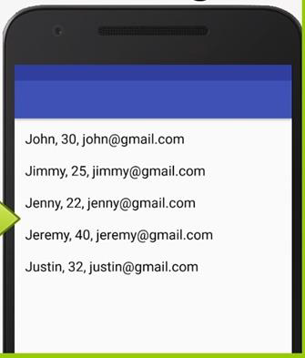
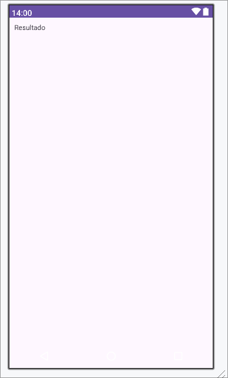

# Consumo de una API RESTful usando volley
Implementación una aplicación nativa Android que muestre la información de una API RESTful en formato JSON 
Se uso Google Volley con uso el siguiente link:
https://jsonplaceholder.typicode.com/users

La aplicación se parcio para verse de la siguiente forma:

## Funcionamiento de la aplicacion

La aplicacion sigue los siguientes pasos:
1. Se crea un objeto Textview donde se van a registar los resultados.
2. Se ejecuta el metodo enviarVolley() directamente en el onCreate.
3. Dentro del metodo enviatVolley() y dentro de OnResponse se llama a la clase JsonParser.
    1. La clase JsonParser recoje la respuesta del onCreate y lo parsea siguiendo el formato "NombreUsuario, 
    2. La respuesta devuelve un String.
4. Se guarda el resultado dentro del Textview.

## Aplicacion antes de la ejecución

## Aplicación despues de la ejecución

## Video de Funcionamiento

[Funcinamiento.mp4](https://github.com/afreireo/semana3_API/assets/86501595/a3aefa02-2a38-4c7f-87fb-dc5bf1026823)

